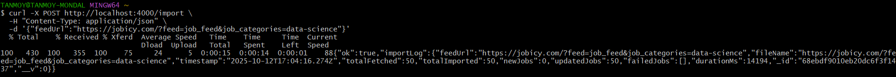

test server link : https://job-importer-m3z5.vercel.app/

## Folder Structure

```sh
└── job-importer.git/
    ├── backend
    │   ├── .gitignore
    │   ├── package-lock.json
    │   ├── package.json
    │   └── src
    │       ├── db.js
    │       ├── index.js
    │       ├── models
    │       │   ├── ImportLog.js
    │       │   └── Job.js
    │       ├── producer.js
    │       ├── queue.js
    │       ├── utils
    │       │   └── xmlToJson.js
    │       └── worker.js
    └── frontend
        ├── .gitignore
        ├── README.md
        ├── components.json
        ├── eslint.config.mjs
        ├── next.config.ts
        ├── package-lock.json
        ├── package.json
        ├── postcss.config.mjs
        ├── public
        │   ├── file.svg
        │   ├── globe.svg
        │   ├── next.svg
        │   ├── vercel.svg
        │   └── window.svg
        ├── src
        │   ├── app
        │   │   ├── api
        │   │   ├── favicon.ico
        │   │   ├── globals.css
        │   │   ├── layout.tsx
        │   │   └── page.tsx
        │   ├── components
        │   │   ├── DataList.tsx
        │   │   └── ui
        │   └── lib
        │       ├── dbConnect.ts
        │       └── utils.ts
        └── tsconfig.json
```


# Frontend

## Tech Stack

- **Framework:** Next.js  
- **Language:** TypeScript  
- **UI Library:** ShadCN UI  
- **HTTP Client:** Axios  
- **Database:** MongoDB (via Mongoose)

## Setup Instructions

1. **Clone the repository**

```bash
git clone https://github.com/Tanmoy-Mondal-07/job-importer.git
cd frontend
````

2. **Install dependencies**

```bash
npm install
```

3. **Create environment variables**

Create a `.env` file in the `frontend` directory and add your MongoDB connection URL:

```env
MONGODB_URI=<your-mongodb-connection-url>
```

4. **Run the development server**

```bash
npm run dev
```

The frontend will start at [http://localhost:3000](http://localhost:3000)

---

# Backend (Node.js + Redis + Bull + MongoDB)

---

## 📋 Features

- 🔄 Fetches XML job feeds and converts them to JSON  
- 📦 Pushes each job into a Redis queue using **Bull**  
- ⚙️ Worker processes queued jobs and inserts/updates MongoDB records  
- 🧾 Logs each import run (total, new, updated, failed) in `import_logs`  
- 🕓 Automatic imports every 1h (configurable via `node-cron`)  
- 🧱 Retry logic + exponential backoff for failed jobs  
- 🧩 Modular structure: clear separation of producer, worker, and server  
- 🧠 Scalable for microservices and cloud deployment  

---

## ⚙️ Tech Stack

| Layer | Technology |
|-------|-------------|
| Backend | Node.js (Express) |
| Queue | Redis + Bull |
| Database | MongoDB (Mongoose) |
| Scheduler | node-cron |
| Parser | xml2js |
| HTTP Client | axios |

---

## Setup Instructions

1. **Clone the repository**

```bash
git clone https://github.com/Tanmoy-Mondal-07/job-importer.git
cd backend
````

2. **Install dependencies**

```bash
npm install
```

3. **Create environment variables**

Create a `.env` file in the `backend` directory

```env
MONGO_URI=<your-mongodb-connection-url>

REDIS_HOST=
REDIS_PORT=
REDIS_PASSWORD=

QUEUE_NAME=
WORKER_CONCURRENCY=5
BATCH_SIZE=100

FEEDS="",""

PORT=""
```

4. **Start Redis locally using Docker**

```bash
docker run -d -p 6379:6379 redis
```

5. **Start the Bull worker**
```bash
npm run worker
```
5. **Run the development server(in a separate terminal)**

```bash
npm run start
```

## Automatic import
### The app automatically runs every 1h using node-cron.

### To change the schedule:
```
Frequency	Cron Expression	Description
Every minute	* * * * *	default
Every 30 minutes	*/30 * * * *	half-hourly
Every hour	0 * * * *	hourly
You can edit this inside src/index.js:
```

## Manual import

### Trigger manually via REST API:

```
curl -X POST http://localhost:4000/import \
  -H "Content-Type: application/json" \
  -d '{"feedUrl":"https://jobicy.com/?feed=job_feed&job_categories=data-science"}'
```


## API Endpoints
```
Method	Endpoint	Description
GET /	Health check	Returns "Job importer running"
POST /import	Manual trigger	Imports feed (use body: { "feedUrl": "..." })
```
## 🧰 Example Response
```
"success": true,
    "data": [
        {
            "_id": "68eb480dd643946cf4d5f4a1",
            "feedUrl": "https://jobicy.com/?feed=job_feed",
            "fileName": "https://jobicy.com/?feed=job_feed",
            "timestamp": "2025-10-12T06:17:49.371Z",
            "totalFetched": 50,
            "totalImported": 50,
            "newJobs": 50,
            "updatedJobs": 0,
            "failedJobs": [],
            "durationMs": 9350,
        }]
```